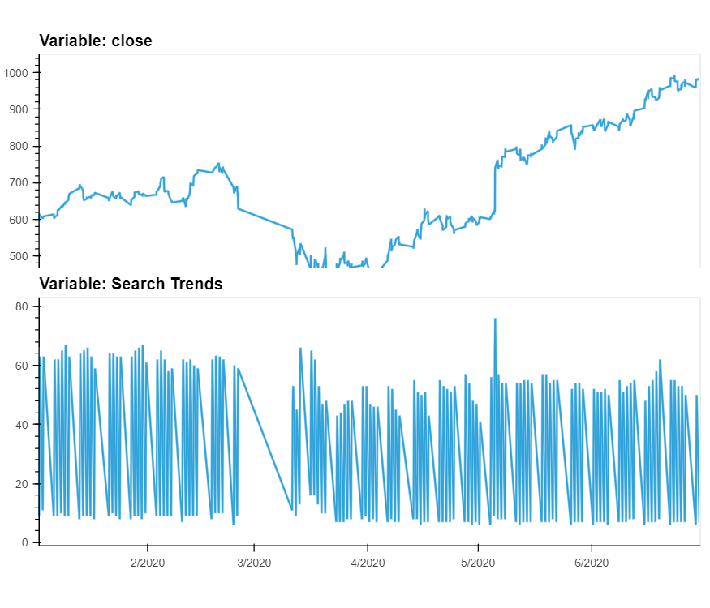

# Growth Analysis: MercadoLibre
The aim of this project is to use visualizations to predict trends and use a Prophet forecast model to predict growth. The goal is determine seasonality and correlation between Google Search Traffic and the company stock price.

## About
MercadoLibre is the top e-commerce platform in Latin America. This project will visualize and predict trends realated to the company and how they might correlate to the company stock price. The main Python libraries that will be used are hvPlot and prophet. hvPlot will be the main package to create the visualizations and prohet will be used to create a model that can be used to forecast future values. By understanding the underlying causes, specific actions could be put in place at the right time to increase the company's growth.

## Getting Started
To run the Jupyter notebook and interact with the visualizations and models, you need to have the following software and Python libraries installed:

- Python 3.10 or later
- Anaconda Distribution
- Pandas
- hvPlot
- holoviews
- prophet

## Installing
1. Install the latest verion of Python [here](https://www.python.org/downloads/).

2. Install the latest version of Anaconda [here](https://www.anaconda.com/download).

3. Installing Anaconda includes the Pandas package.

4. To install the hvPlot, holoviews and prophet packages, run the following command in your terminal.

```
pip install prophet
pip install hvplot
pip install holoviews
```

## Usage
> **_NOTE:_**  The visualizations of the interactive plots do not show up in the Jupyter Notebook on GitHub. Please clone or download the project to interact with the plots.

You can clone or download this GitHub project and open the `forecasting_net_prophet.ipynb` using Jupyter Notebook. The Jupyter Notebook is seperated into sections that cover different aspects of the analysis. Each section contains explanations, code snippets, and interactive visualizations. By executing each cell in the Jupyter Notebook you can then interact with the visualizations.

## Project Summary

### Patterns in Hourly Google Search Traffic


There seems to be a spike in search traffic on May 5, 2020.

The total search traffic for the month of May 2020 is 38181.

The monthly median search traffic across all months is 35172.5

**Question:** Did the Google search traffic increase during the month that MercadoLibre released its financial results?

**Answer:** Yes, the Google search traffic did increase during the month that MercadoLibre released its financial results in May 2020.

### Search Traffic Data for Seasonality


**Question:** Does any day-of-week effect that you observe concentrate in just a few hours of that day?

**Answer:** The highest search trend traffic is concentrated around 10PM-1AM each day with the overall day-of-week trend peaking on Tuesday and then slowly rolling off as the week progresses.


**Question:** Does the search traffic tend to increase during the winter holiday period (weeks 40 through 52)?

**Answer:** Yes, looking at the winter holiday period from weeks 40 to 52, there is an increase in search traffic.

### Search Traffic to Stock Price Patterns


**Question:** Do both time series indicate a common trend that’s consistent with this narrative?

**Answer:** Yes, both time series indicate a common trend that's consistent with this narrative since the search trends and closing price plateau and decline betweeen January 2020 to March 2020, and then start to increase and reach new highs between April 2020 to June 2020.


**Question:** Does a predictable relationship exist between the lagged search traffic and the stock volatility or between the lagged search traffic and the stock price returns?

**Answer:** No, ther edoes not seem to be any predictable relationship between the lagged search traffic and the stock volatility or between the lagged search traffic and the stock price returns

### Time Series Model with Prophet


**Question:**  How's the near-term forecast for the popularity of MercadoLibre?

**Answer:** The near-term forecast for the popularity of MercadoLibre seems to be decreasing.


**Question:** What time of day exhibits the greatest popularity?

**Answer:** The time of day that exhibits the greatest popularity is at **00:00:00**, which is **midnight**.

**Question:** Which day of week gets the most search traffic?
   
**Answer:** The day of the week that gets the most search traffic is **Tuesday**.

**Question:** What's the lowest point for search traffic in the calendar year?

**Answer:** The lowest point for search traffic in the calendar year is around the middle of **October**.

### Forecast Revenue by Using Time Series Models


**Question:** For example, what are the peak revenue days? (Mondays? Fridays? Something else?)

**Answer:** The peak revenue days are Monday, Tuesday and the highest, which is **Wednesday**.


**Answer:** The sales forecast for the next quarter is expected to be approximately **970 daily sales**. In the best case, this number may reach approximately **1052 daily sales**, and in the worse case **887 daily sales**.

## Contributor
Andy Vu